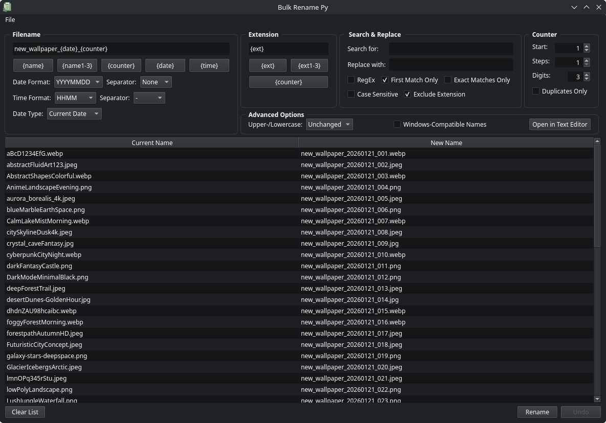

# Bulk Rename Py

**Bulk Rename Py** is a Python application for **renaming files in bulk**.

It provides a wide range of features for conveniently renaming large numbers of files, including instant previews, an undo function, and support for freely combinable naming patterns.



---

## Technical Requirements

- **Python:** **>= 3.13**
- **Dependencies:** see [`requirements.txt`](requirements.txt)
- **Operating systems:**
  - Linux (tested on Arch Linux)
  - Windows (tested on Windows 11)

---

## Installation

Clone the repository and set up a Python virtual environment:

```bash
git clone https://github.com/codemorra/bulk-rename-py.git
cd bulk-rename-py
python -m venv .venv
source .venv/bin/activate        # Windows: .venv\Scripts\activate
pip install --upgrade pip
pip install -r requirements.txt
python src/bulk_rename_py.py     # Windows: python src\bulk_rename_py.py
```

### Optional: Create a Desktop Shortcut

#### **Linux (desktop environments with .desktop files)**

1. Copy the provided `.desktop` file from the repository to the appropriate directory:

    ```bash
    cp packaging/linux/bulk-rename-py.desktop ~/.local/share/applications/
    ```

2. Copy the icon files to the corresponding hicolor directories:

    ```bash
    for s in 16 32 64 128 256 512; do
        install -Dm644 assets/icons/png/bulk-rename-py_${s}.png ~/.local/share/icons/hicolor/${s}x${s}/apps/bulk-rename-py.png
    done
    ```

3. Open the copied file (`~/.local/share/applications/bulk-rename-py.desktop`) and adjust **Exec** and **TryExec** to your local installation path, for example:

    ```ini
    Exec='<PATH_TO_REPOSITORY>/.venv/bin/python3' '<PATH_TO_REPOSITORY>/src/bulk_rename_py.py'
    TryExec=<PATH_TO_REPOSITORY>/.venv/bin/python3
    ```

4. Make the file executable:

    ```bash
    chmod +x ~/.local/share/applications/bulk-rename-py.desktop
    ```

    The application should now appear in the application menu and can be pinned to the desktop.  
    *(You may need to refresh the desktop cache for it to become visible.)*

#### **Windows**

1. Right-click on the desktop → New → Shortcut
    - Target:
      ```
      "<PATH_TO_REPOSITORY>\.venv\Scripts\pythonw.exe" "<PATH_TO_REPOSITORY>\src\bulk_rename_py.py"
      ```

2. Right-click the shortcut → Properties → Change Icon...
    - Select icon:
      ```
      <PATH_TO_REPOSITORY>\assets\icons\bulk-rename-py.ico
      ```

---

## Updates

You can check for available updates in the About dialog. If an update is available, this will be indicated next to the version number.

To update the application, run:
```bash
git pull
pip install -r requirements.txt --upgrade
```

---

## Function Overview

- Independent editing of filenames and file extensions
- Flexible replacement of entire names or selected parts
- Preview-based workflow:
  - Current filenames are shown on the left
  - New filenames are shown on the right
  - Changes are applied only after confirmation

---

### Main Functions

#### **Filename Editing**
- Placeholders:
  - `{name}`: current filename
  - `{name1-3}`: specific parts of the current filename
  - `{counter}`: configurable counter
  - `{date}`: current date or file modification date (selectable)
  - `{time}`: current time or modification time (selectable)
- Prefixes and suffixes
- Complete filename replacement
- Customizable date and time formats and separators

#### **File Extension Editing**
- Placeholders:
  - `{ext}`: current file extension
  - `{ext1-3}`: specific parts of the current extension
  - `{counter}`: configurable counter
- Prefixes and suffixes
- Complete extension replacement

#### **Search & Replace**
- Wildcard support:
  - `*` = replaces everything between the first and next occurrence
  - `**` = replaces everything between the first and last occurrence
  - `?` = represents a single arbitrary character
- Optional features:
  - Regular expressions
  - Case sensitivity
  - Exact matching
  - Replace first match only
  - Exclude file extensions

#### **Counter**
- Automatic numbering with configurable start value, increment, and digit width
- Optional: number duplicates only

#### **Advanced Options**
- **Uppercase / lowercase conversion**
- **Windows-compatible filenames:** automatically removes or replaces invalid characters (`<>:"/\|?*`) and prevents reserved names (`CON`, `PRN`, `AUX`, `NUL`, `COM1–COM9`, `LPT1–LPT9`)
- **External editing:** open the preview list in a text editor for manual adjustments

---

### Additional features

- Import individual files or entire directories
- Option to include hidden files
- Drag & drop support from the file manager
- Detection of duplicate or invalid target filenames
- Undo functionality
- Available languages: German and English

---

## Behavior & Notes

- **Filename length checks:** automatic validation for maximum filename length (Windows) and byte length (Linux)
- **Windows-compatible naming:** always enabled on Windows, optional on Linux
- **.lnk directory shortcuts (Windows):** can only be added via *Add folder*; using *Add file(s)* opens the target directory instead
- **External editor workflow:** changes are applied only after saving the edited file
- **Undo function:** the undo history is cleared if the file list is modified, cleared, or if the application is closed

---

## :warning: Important Safety Notice :warning:

### Always create a backup before renaming files!

While the application does not overwrite files automatically, unexpected issues (e.g. special characters or file permission problems) may still occur.

**The developer assumes no responsibility for data loss.**

---

## License

This project is licensed under the **MIT License**.  
See [`LICENSE`](LICENSE) for the full license text.

Third-party libraries used by this project are licensed under their respective licenses.  
All third-party license texts are collected in [`THIRD_PARTY_LICENSES.txt`](THIRD_PARTY_LICENSES.txt).

---

## Developer & Project Page

**Developer:** Codemorra  
**Project Page:** [https://github.com/codemorra/bulk-rename-py](https://github.com/codemorra/bulk-rename-py)  
© 2026-present Codemorra – All rights reserved.
